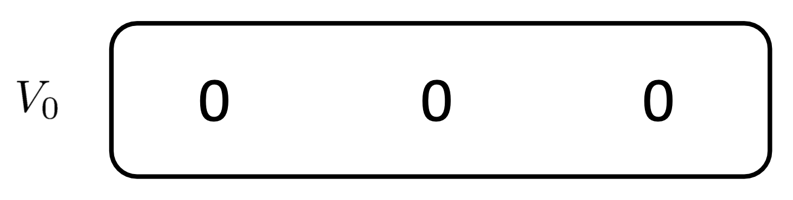
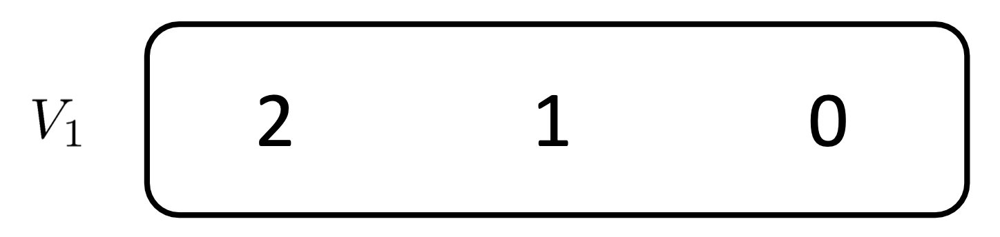

# Markov Decision Processes
* An MDP is defined by:
    * A set of s  S
    * A set of actions a 
    * A transition function T(s, a, s')
        * Probability that a from s leads to s’, i.e., P(s’| s, a)
        * Also called the model or the dynamics

        * a: action
        * s: state 

## Example 1:

* Iteration 0 
    * 
* Iteration 1
    * At Cool
        * Q*(Cool, slow)
            * 1.0 (1 + 0) = 1, s' = Cool
        * Q*(Cool, fast)
            * 0.5 (2 + 0) = 1, s' = Warm
            * 0.5 (2 + 0) = 1, s' = Cool
            * Sum -> 2
        * --> 2, fast At Cool, V1 
    * At Warm 
        * Q*(Warm, Slow)
            * 0.5 (1 + 0) = 0.5, s' = Warm
            * 0.5 (1 + 0) = 0.5, s' = Cool
            * Sum -> 1
        * Q*(Warm, fast)
            * 1.0 (-10 + 0) = -10, s' = Overheated
        * --> 1, slow At Warm V1
    * At Overheated
        * No action -> 0
    * 

## Example 2:
