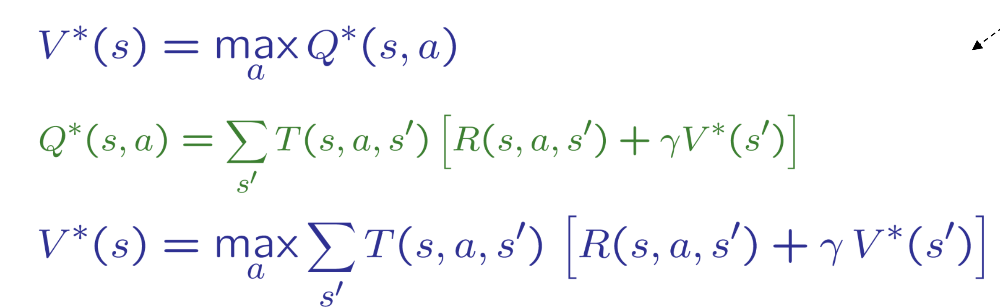
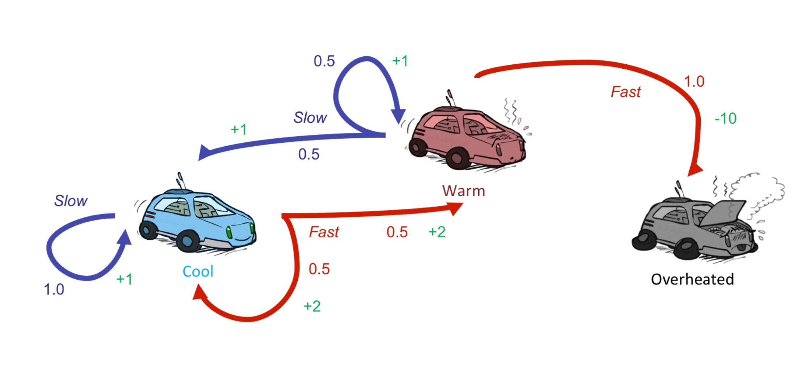

# Markov Decision Processes
* An MDP is defined by:
    * A set of s  S
    * A set of actions a 
    * A transition function T(s, a, s')
        * Probability that a from s leads to s’, i.e., P(s’| s, a)
        * Also called the model or the dynamics

        * a: action
        * s: state 

## Example 1:
|_______|

## Example 2:
