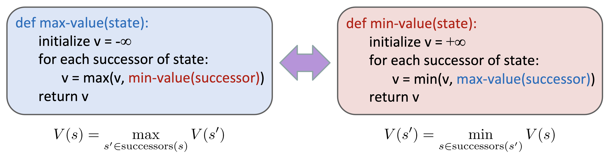
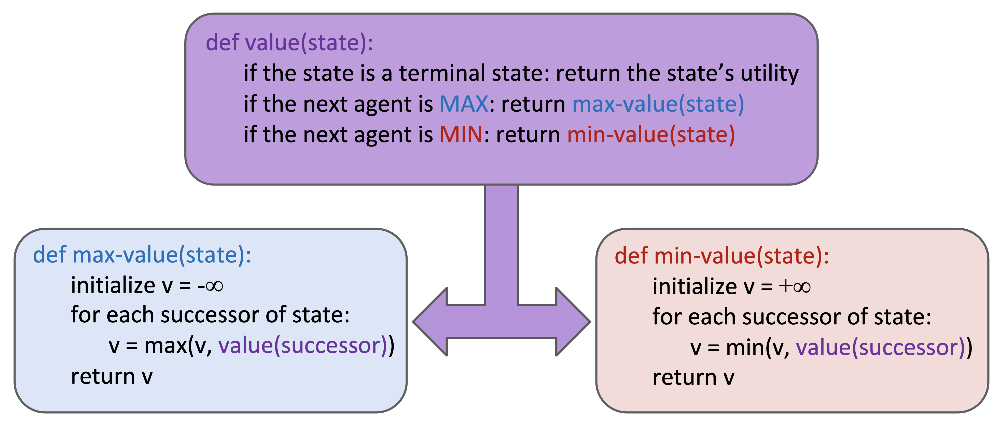
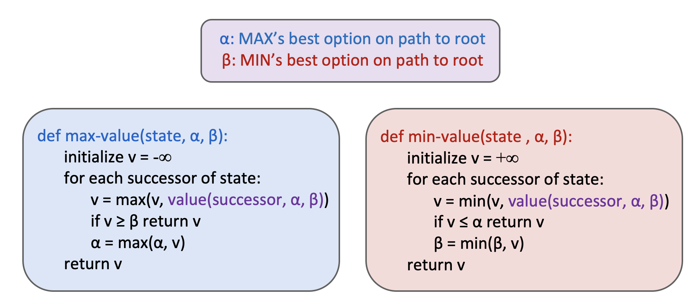

# Minimax
* 2 agents trying to compete each others. 
    * For example: 
        * Pacman tries to get higher score (he decides MAX)
        * Ghosts try to make lower score for max (they decide MIN)
            * Non dispatch
                    
            * Dispatch
                    

# Alpha-Beta 
* Same as a minimax but eliminate unnecessary sub-tree. 
* Alpha is for MAX level (save maximum level) - Beta is for MIN (save minimum value)

                    