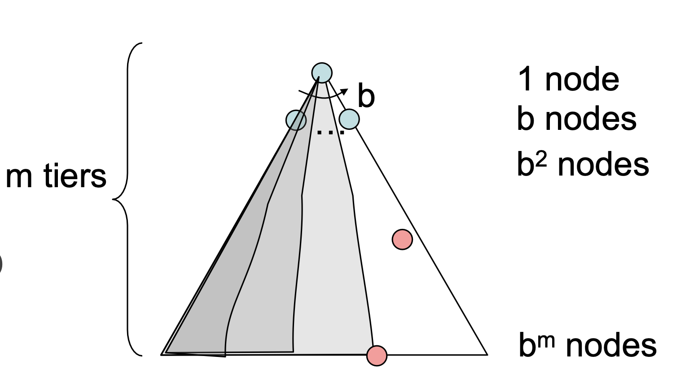
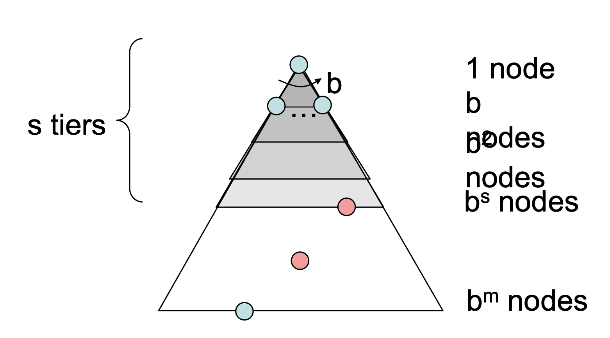
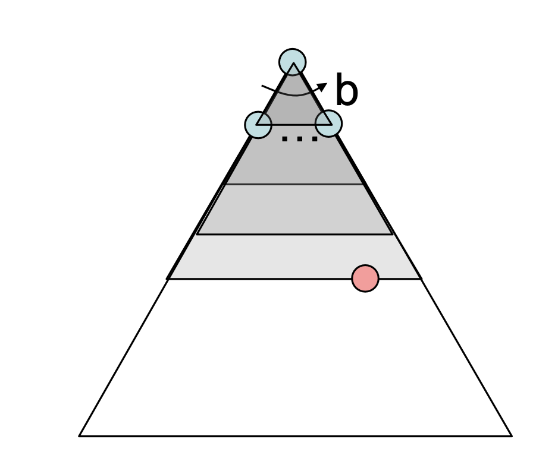
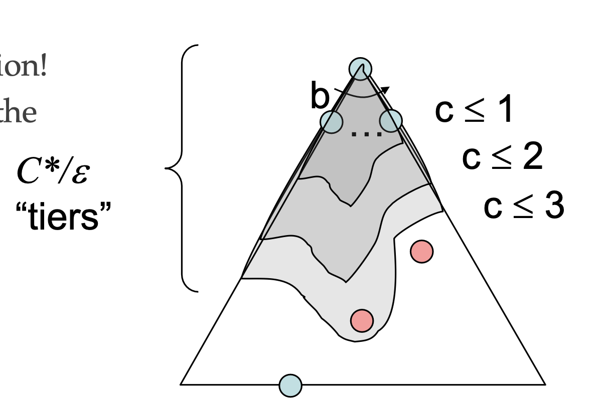

# DFS

* $\ 1 + b + b^2 + b^3 + ... + b^m = O(b^m) $

# BFS 

* 1 < s < m
* O($\ b^s $)

# Iterative Deepening

* get DPF's space advantage with BFS's time / shallow-solution advantages.
    * Run a DFS with depth limit 1. If no solution...
    * Run a DFS with depth limit 2. If no solution...
    * Run a DFS with depth limit 3. .....

# Uniform Cost Search

* Strategy: expand a cheapest node first
* Processes all nodes with cost less than cheapest solution! b
* If that solution costs $\ C*$ and arcs cost at least e, then the “effective depth” is roughly $\ C*/e$
* Takes time $\ O(b^(C*/e))$ (exponential in effective depth)

# Algorithms
* DFS: Fringe is a Stack
* BFS: Fringe is a Queue
* UCS: Fringe is a PriorityQueue